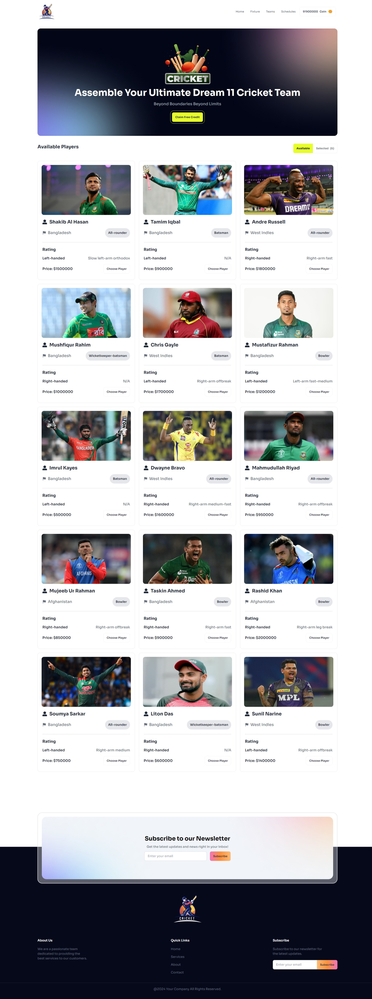
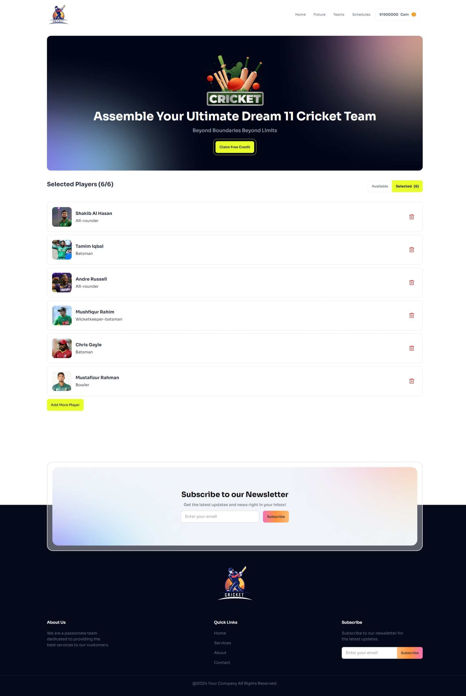

# Title:

- BPL Dream 11 - React Project - Assignment 7

## Description

This is a simple React project that allows you to select a player from a list of players and add the price of the player to the coin balance. The project also includes a footer with a newsletter subscription form.

## Features

- Display a list of players with their images, names, roles, batting styles, bowling styles, and bidding prices.
- Allow the user to select a player and add the bidding price to the coin balance.
- Display the coin balance and allow the user to claim free credits.
- Include a newsletter subscription form.

## Technologies Used

- React
- Tailwind CSS
- DaisyUI
- React Toastify
- PropTypes
- React Icons
- Cloudinary

# Live Demo

### - [Live Demo Link - 1](https://batch10-assignment-7.netlify.app)

### - [Live Demo Link - 2](https://batch10-assignment-7.surge.sh)

# Screenshots

